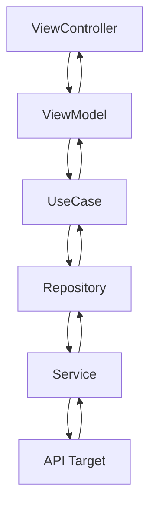

# Output Schema — ct-ai-document

## Document Structure

The generated `.md` file must contain all sections below in this exact order.

Sections marked `(Low only)` are only included when `PRIORITY = Low`.
Sections marked `(Medium+)` are included for `Medium` and `Low`.

---

```markdown
# [Feature Name] — Feature Document

> **Jira:** [CRE-XXXXX](https://701search.atlassian.net/browse/CRE-XXXXX) | **Branch:** `branch-name` | **Generated:** YYYY-MM-DD

---

## PRD Summary

> What the feature does and why it exists.

- **Goal:** <one-sentence feature goal>
- **User story:** As a <user type>, I want to <action> so that <outcome>
- **Acceptance criteria:**
  - [ ] <criterion 1>
  - [ ] <criterion 2>

---

## Business Rules

> Key business constraints and logic that developers must respect.

| Rule | Description |
|------|-------------|
| <Rule 1> | <description> |
| <Rule 2> | <description> |

---

## Architecture Overview

> MVVM + Clean Architecture layers involved in this feature.

### Key Components

| Layer | File | Role |
|-------|------|------|
| Presentation | `ViewControllers/XViewController.swift` | Handles UI events |
| Presentation | `ViewModels/XViewModel.swift` | Transforms domain data for UI |
| Domain | `UseCases/XUseCase.swift` | Business logic |
| Data | `Repositories/XRepository.swift` | Data access abstraction |
| Data | `Services/XService.swift` | API calls |
| Data | `Targets/XTarget.swift` | API target definition |

### Data Flow

```
User Interaction
  → ViewController (PresentableListener relay)
  → ViewModel (didBecomeActive / executeUseCase)
  → UseCase (action?.execute)
  → Repository → Service → API Target
  ← UseCase (action?.elements)
  ← ViewModel (presenter relay.accept)
  ← ViewController (UI update)
```

<!-- Architecture Diagram (Low only) -->


---

## Key Files & Symbols

> All Swift files modified or created for this feature.

### Presentation
- [`XViewController.swift`](relative/path/XViewController.swift) — description
- [`XViewModel.swift`](relative/path/XViewModel.swift) — description

### Domain
- [`XUseCase.swift`](relative/path/XUseCase.swift) — description

### Data
- [`XRepository.swift`](relative/path/XRepository.swift) — description
- [`XService.swift`](relative/path/XService.swift) — description
- [`XTarget.swift`](relative/path/XTarget.swift) — description

### Models
- [`XModel.swift`](relative/path/XModel.swift) — Codable response model

---

## API Contracts

> Endpoints introduced or modified by this feature.

| Method | Endpoint | Input | Output |
|--------|----------|-------|--------|
| `POST` | `/api/v1/example` | `ExampleInput` | `ExampleResponse` |

### Request Model

```swift
struct ExampleInput {
    let param1: String
    let param2: Int
}
```

### Response Model

```swift
struct ExampleResponse: Codable {
    let result: String
    let data: [ExampleItem]
}
```

---

## Edge Cases & Error Handling

> Scenarios that require special handling.

<!-- Full table (Medium+) -->
| Scenario | Expected Behavior | Handled? |
|----------|------------------|----------|
| Network offline | Show error toast, retain last state | ✅ / ❌ |
| Empty response | Show empty state UI | ✅ / ❌ |
| Authentication expired | Redirect to login | ✅ / ❌ |
| Invalid input | Inline validation error | ✅ / ❌ |
| API error 500 | Generic error message | ✅ / ❌ |

---

## Test Coverage Notes

<!-- Test matrix (Medium+) -->
| Component | Test File | Coverage |
|-----------|-----------|----------|
| `XViewModel` | `XViewModelSpec.swift` | ✅ / ❌ Missing |
| `XUseCase` | `XUseCaseSpec.swift` | ✅ / ❌ Missing |
| `XRepository` | `XRepositorySpec.swift` | ✅ / ❌ Missing |

**Suggested test cases:**
- [ ] Test success path: valid input → correct state relay emitted
- [ ] Test error path: API failure → error state emitted
- [ ] Test empty state: empty array response → empty state flag set

---

## Notes

> Additional context, open questions, or known limitations.

- <Any open question or limitation>

---

*Generated by `/ct-ai-document` on YYYY-MM-DD*
```

---

## Completion Block

Print this after the file is written:

```
━━━━━━━━━━━━━━━━━━━━━━━━━━━━━━━━━━━━━━
✅ ct-ai-document COMPLETE
━━━━━━━━━━━━━━━━━━━━━━━━━━━━━━━━━━━━━━

Document: <OUTPUT_PATH>
Sources:  Jira <JIRA_KEY or "—"> | Confluence <"fetched" or "—"> | Git diff <N files>

💡 Suggested Next Steps:
  1. /ct-quality-engineer — validate feature against this document
  2. /ct-unittest — generate missing test cases
  3. /review-code — audit implementation against business rules
━━━━━━━━━━━━━━━━━━━━━━━━━━━━━━━━━━━━━━
```

Only suggest steps relevant to what was found. Never auto-invoke them.
