# Workflow Diagram - Visual Data Flow
## report_lms Application

---

## 📊 Complete Workflow Visualization

```mermaid
flowchart TB
    Start([User Opens App]) --> Home[LMSHomeView]
    
    Home -->|Tap "Tạo kiểm tra"| Create[CreateInspectionView]
    Home -->|Select Inspection| Detail[InspectionDetailView]
    
    Create -->|Fill Form| CreateForm{User Input}
    CreateForm -->|Submit| CreateInspection[Create Inspection Object]
    CreateInspection --> Callback[onInspectionCreated callback]
    Callback --> Home
    
    Detail -->|Load Data| LoadDetail[Load InspectionDetail]
    LoadDetail --> DetailTabs{Display Tabs}
    
    DetailTabs --> Tab1[Tab: Kiểm tra]
    DetailTabs --> Tab2[Tab: Lỗi]
    DetailTabs --> Tab3[Tab: Thông tin đơn hàng]
    
    Tab1 --> Sections[Display Sections & Fields]
    Sections -->|Tap Camera Icon| Camera[CameraView]
    Camera -->|Capture| Photos[Save to capturedPhotos]
    Photos --> Sections
    
    Sections -->|Tap "Hoàn tất kiểm tra"| Final[FinalReportView]
    
    Final -->|Generate PDF| BuildRequest[PDFReportRequestBuilder]
    BuildRequest -->|.withDefaults| Builder1[Set Inspector Name]
    Builder1 -->|.with detail:| Builder2[Add InspectionDetail]
    Builder2 -->|.with images:| Builder3[Add Captured Images]
    Builder3 -->|.with location:| Builder4[Add Location]
    Builder4 -->|.build| Request[PDFReportRequest]
    
    Request --> UseCase[GenerateHTMLPDFReportUseCase]
    UseCase --> GenerateHTML[Generate HTML Content]
    GenerateHTML --> ConvertPDF[Convert HTML to PDF]
    ConvertPDF --> PDFData[PDF Data]
    
    PDFData --> Actions{User Action}
    Actions -->|Preview| Preview[Display PDF Preview]
    Actions -->|Send Email| Email[Send via Mail]
    Actions -->|Upload| Firestore[Upload to Firestore]
    
    Preview --> End([Done])
    Email --> End
    Firestore --> End

    style Home fill:#e1f5ff
    style Create fill:#fff4e1
    style Detail fill:#e8f5e9
    style Final fill:#fce4ec
    style Request fill:#f3e5f5
    style UseCase fill:#e0f2f1
    style PDFData fill:#fff9c4
```

---

## 🔄 Data Model Transformation Flow

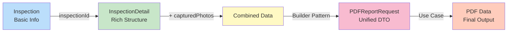

---

## 🏗️ Clean Architecture Layers

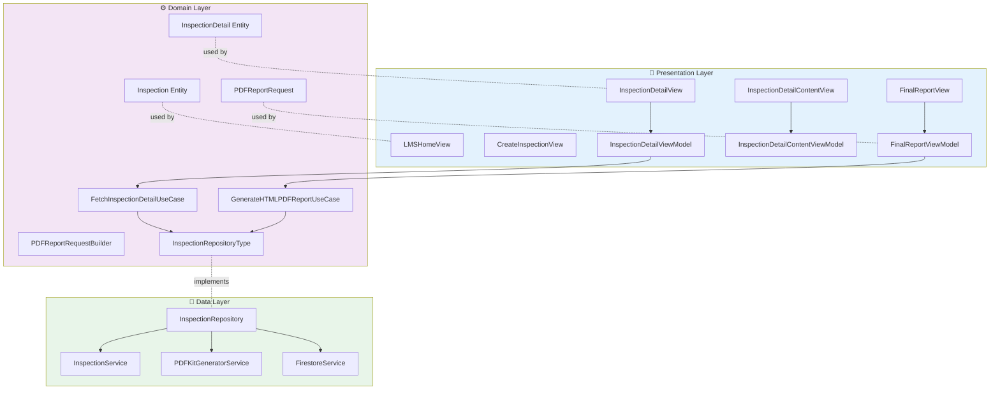

---

## 📸 Photo Capture Flow

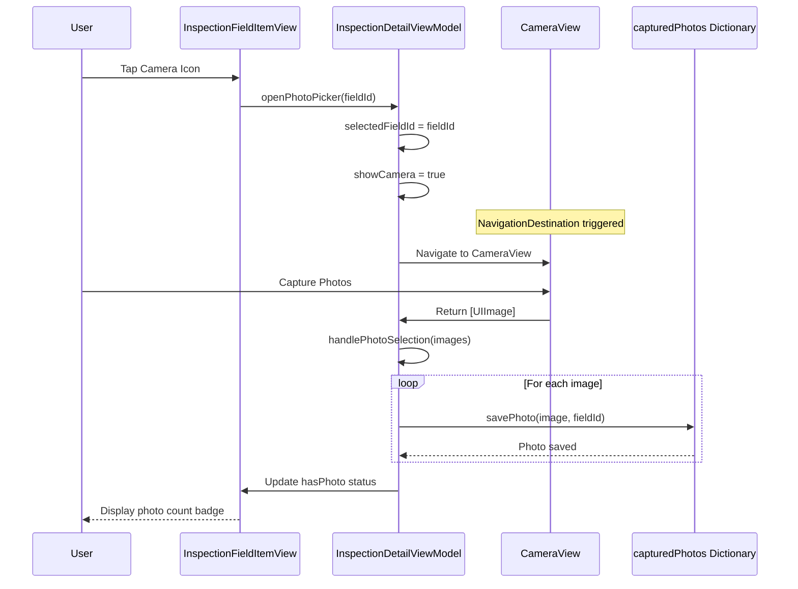

---

## 🔨 Builder Pattern Workflow

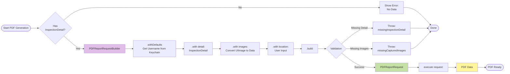

---

## 🗂️ Data Structure Relationships

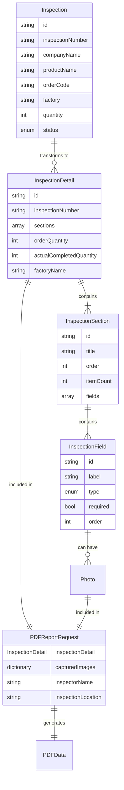

---

## 🎯 Navigation Types

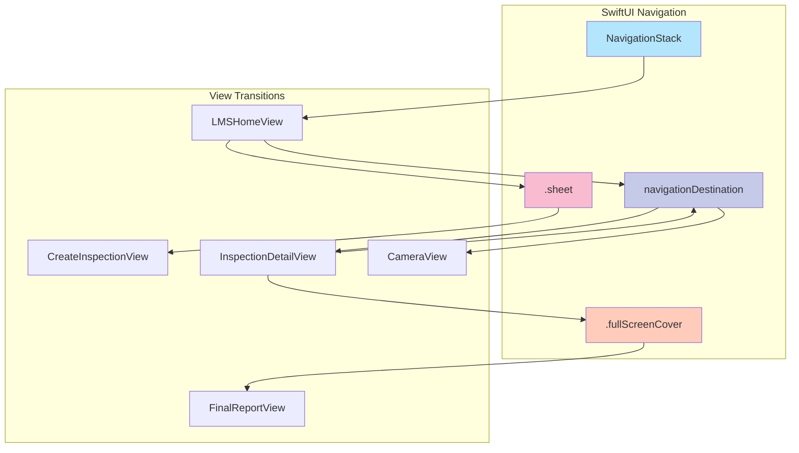

---

## 📦 PDFReportRequest Properties

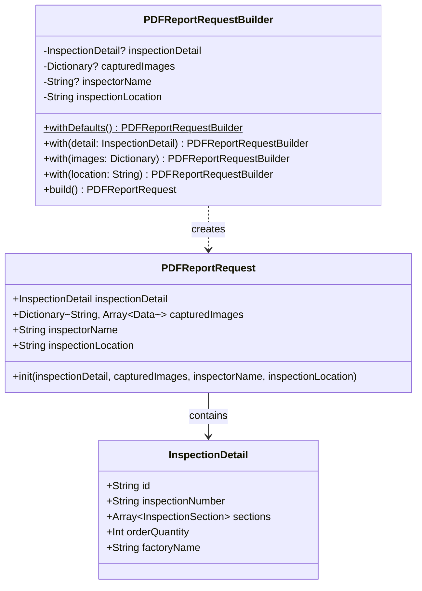

---

## 🧪 State Management Flow

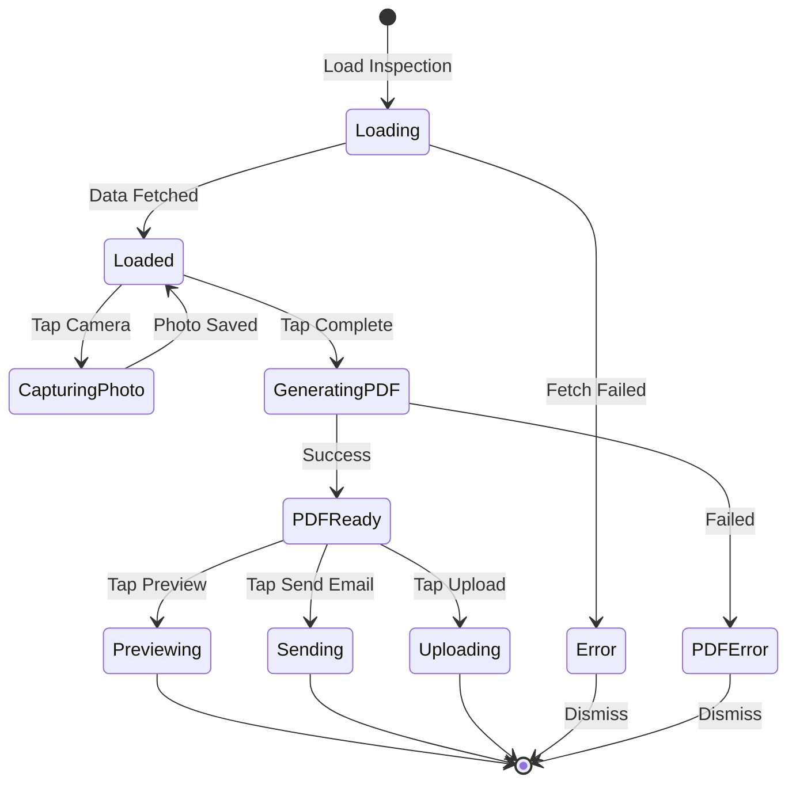

---

## 🔐 KeychainManager Integration

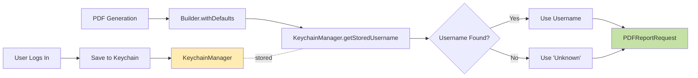

---

## 📊 Layer Communication Summary

```mermaid
graph TB
    subgraph UI["User Interface"]
        Views[SwiftUI Views]
    end
    
    subgraph VM["ViewModels"]
        ViewModels[@Published Properties<br/>@MainActor]
    end
    
    subgraph UC["Use Cases"]
        UseCases[Business Logic<br/>async/await]
    end
    
    subgraph Repo["Repositories"]
        Protocols[Protocol Definitions]
        Impl[Implementations]
    end
    
    subgraph Services["Services"]
        API[API Calls]
        Storage[Local Storage]
        PDF[PDF Generation]
    end
    
    Views -->|Observe| ViewModels
    ViewModels -->|Call| UseCases
    UseCases -->|Depend on| Protocols
    Protocols -->|Implemented by| Impl
    Impl -->|Use| API
    Impl -->|Use| Storage
    Impl -->|Use| PDF
    
    style UI fill:#e1f5fe
    style VM fill:#f3e5f5
    style UC fill:#e8f5e9
    style Repo fill:#fff9c4
    style Services fill:#ffccbc
```

---

## 🎬 Complete User Journey

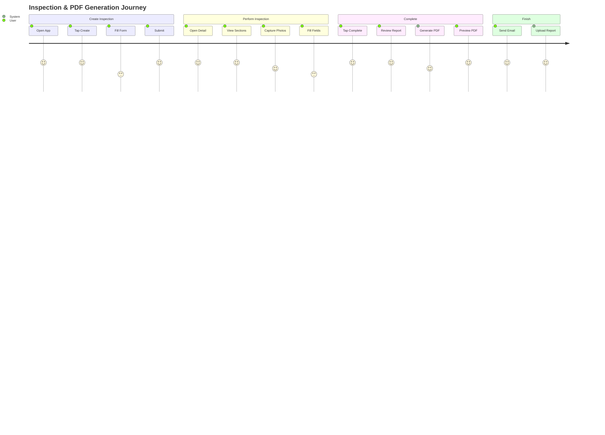

---

## 🚦 Error Handling Flow

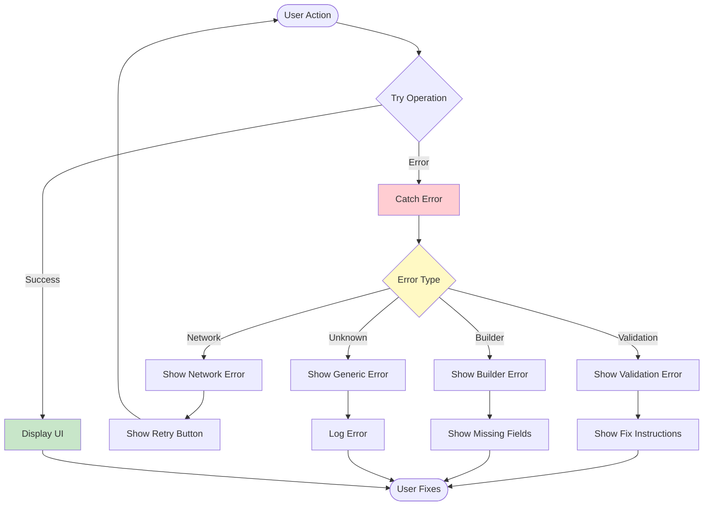

---

## 📝 Quick Legend

| Symbol | Meaning |
|--------|---------|
| 🎨 | Presentation Layer |
| ⚙️ | Domain Layer |
| 💾 | Data Layer |
| 📸 | Photo/Image Related |
| 🔨 | Builder Pattern |
| 🔐 | Authentication/Security |
| 🚦 | Error Handling |
| 🎯 | Navigation |

---

## 🔗 Related Documents

- [Detailed Workflow Analysis](WORKFLOW_DATA_FLOW.md)
- [Architecture Guide](/.github/instructions/architecture.instructions.md)
- [Alternative Approaches](ALTERNATIVE_APPROACHES_PDF_REFACTORING.md)

---

**Document Version:** 1.0  
**Last Updated:** January 2026  
**Author:** GitHub Copilot
