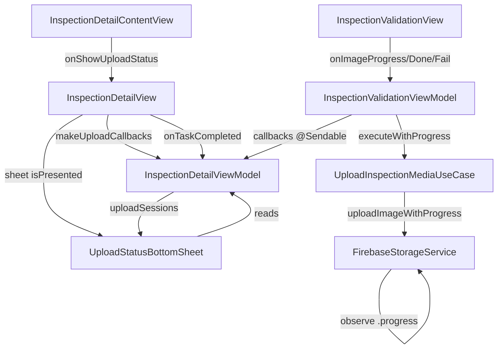

# Upload Status Bottom Sheet — Feature Document

> **Jira:** — | **Branch:** `feat/login` | **Generated:** 2026-06-06

---

## PRD Summary

> Cho phép user theo dõi tiến trình upload từng ảnh kiểm tra lên Firebase Storage theo thời gian thực.

- **Goal:** Hiển thị bottom sheet progress upload per-image, grouped by inspection field — giải quyết vấn đề user không biết ảnh đang upload khi bấm "Hoàn tất kiểm tra"
- **User story:** As an inspector, I want to see the upload progress of each photo so that I know when it's safe to complete the inspection
- **Acceptance criteria:**
  - [x] Button "Hoàn tất kiểm tra" hiển thị spinner + "Đang tải ảnh (N)..." khi có upload đang chạy
  - [x] Nhấn vào button khi đang upload → mở `UploadStatusBottomSheet`
  - [x] Bottom sheet nhóm ảnh theo từng field (section header = field label)
  - [x] Mỗi ảnh hiển thị: thumbnail, "Ảnh N", progress bar %, status icon
  - [x] Progress % là số thực từ Firebase Storage (`fractionCompleted`)
  - [x] 4 trạng thái: `.pending`, `.uploading(progress:)`, `.done`, `.failed`
  - [x] Khi failed: hiển thị ❌ + "Thất bại" — không có retry
  - [x] Session tự xóa khỏi list khi `activeUploadCount == 0`
  - [x] FinalReport tự mở khi tất cả upload xong nếu user đã tap "Hoàn tất" trước

---

## Business Rules

| Rule | Description |
|------|-------------|
| No retry on failure | Ảnh upload thất bại chỉ hiển thị ❌ — user phải quay lại ValidationView để chụp lại |
| Auto-open FinalReport | Nếu user tap "Hoàn tất" khi đang upload → `pendingFinalReport = true` → FinalReport mở tự động khi upload xong |
| Session cleanup | `uploadSessions.removeAll { $0.isComplete }` chỉ chạy khi `activeUploadCount == 0` |
| Count = images, not fields | `totalUploadingImageCount` đếm ảnh còn pending/uploading (không phải số field) để hiển thị đúng trên button |
| Concurrent upload | Các ảnh trong cùng một field upload song song qua `withTaskGroup` |
| Callbacks are @Sendable | `onImageProgress`, `onImageDone`, `onImageFail` phải `@Sendable` vì được gọi từ trong TaskGroup (non-isolated context) |

---

## Architecture Overview

### Key Components

| Layer | File | Role |
|-------|------|------|
| Presentation | [`UploadStatusBottomSheet.swift`](UploadStatusBottomSheet.swift) | Bottom sheet UI grouped by field |
| Presentation | [`InspectionDetailView.swift`](InspectionDetailView.swift) | Hosts sheet + wires callbacks vào `InspectionValidationView` |
| Presentation | [`InspectionDetailContentView.swift`](InspectionDetailContentView.swift) | Button upload-aware, tap → `onShowUploadStatus()` |
| Presentation | [`InspectionDetailViewModel.swift`](InspectionDetailViewModel.swift) | Source of truth: `uploadSessions`, `showUploadStatusSheet`, `totalUploadingImageCount` |
| Presentation | [`InspectionValidation/InspectionValidationView.swift`](InspectionValidation/InspectionValidationView.swift) | Nhận và forward 3 callbacks vào VM |
| Presentation | [`InspectionValidation/InspectionValidationViewModel.swift`](InspectionValidation/InspectionValidationViewModel.swift) | Gọi callbacks per-image trong `uploadPhotosAndUpdateField` |
| Domain | [`ImageUploadItem.swift`](../../../Domain/Entities/ImageUploadItem.swift) | `ImageUploadStatus`, `ImageUploadItem`, `FieldUploadSession` models |
| Domain | [`UploadInspectionMediaUseCase.swift`](../../../Domain/UseCases/UploadInspectionMediaUseCase.swift) | `executeWithProgress(imageData:inspectionId:onProgress:)` |
| Data | [`FirebaseStorageService.swift`](../../../Data/Services/FirebaseStorageService.swift) | `uploadImageWithProgress` — `putData` + `observe(.progress)` |
| Data | [`StorageRepositoryType.swift`](../../../Domain/Repositories/StorageRepositoryType.swift) | Protocol: `uploadImageWithProgress(_:path:onProgress:)` |
| Data | [`FirebaseStorageRepository.swift`](../../../Data/Repositories/FirebaseStorageRepository.swift) | Forwards đến `FirebaseStorageService` |

### Data Flow

```
Firebase Storage
  putData(_:) + task.observe(.progress) { snapshot }
    → fractionCompleted (0.0 → 1.0)
      → FirebaseStorageService.uploadImageWithProgress()
        → StorageRepositoryType.uploadImageWithProgress()
          → UploadInspectionMediaUseCase.executeWithProgress()
            → InspectionValidationViewModel.uploadPhotosAndUpdateField()
                progressCb(index, progress) / doneCb(index) / failCb(index)
                  → [weak self] Task { @MainActor }
                    → InspectionDetailViewModel
                        updateImageProgress / markImageDone / markImageFailed
                          → @Published uploadSessions → SwiftUI re-render
                            → UploadStatusBottomSheet (live progress bar)
```

### Architecture Diagram



---

## Key Files & Symbols

### Presentation — New Files
- [`UploadStatusBottomSheet.swift`](UploadStatusBottomSheet.swift) — Bottom sheet view; `struct UploadStatusBottomSheet: View`, private `struct ImageUploadRow: View`

### Presentation — Modified Files
- [`InspectionDetailViewModel.swift`](InspectionDetailViewModel.swift)
  - `@Published var uploadSessions: [FieldUploadSession]`
  - `@Published var showUploadStatusSheet: Bool`
  - `var totalUploadingImageCount: Int` — computed, counts pending+uploading images
  - `func startUploadSession(fieldId:images:)` — creates session, calls `notifyUploadStarted()`
  - `func makeUploadCallbacks(for:)` — returns 3 `@Sendable` closures for per-image tracking
  - `func updateImageProgress(fieldId:imageIndex:progress:)`
  - `func markImageDone(fieldId:imageIndex:)`
  - `func markImageFailed(fieldId:imageIndex:)`
- [`InspectionDetailView.swift`](InspectionDetailView.swift) — wires callbacks, hosts `.sheet(isPresented: $viewModel.showUploadStatusSheet)`
- [`InspectionDetailContentView.swift`](InspectionDetailContentView.swift) — `let onShowUploadStatus: () -> Void`; tappable overlay khi `hasActiveUploads`
- [`InspectionValidation/InspectionValidationView.swift`](InspectionValidation/InspectionValidationView.swift) — 3 new init params: `onImageProgress`, `onImageDone`, `onImageFail`
- [`InspectionValidation/InspectionValidationViewModel.swift`](InspectionValidation/InspectionValidationViewModel.swift) — stores và gọi 3 `@Sendable` callbacks từ trong `TaskGroup`

### Domain — New Files
- [`ImageUploadItem.swift`](../../../Domain/Entities/ImageUploadItem.swift)
  - `enum ImageUploadStatus: Equatable` — `.pending`, `.uploading(progress: Double)`, `.done`, `.failed`
  - `struct ImageUploadItem: Identifiable` — `id`, `imageIndex`, `thumbnail: UIImage?`, `status: ImageUploadStatus`
  - `struct FieldUploadSession: Identifiable` — `id` (fieldId), `fieldLabel`, `items: [ImageUploadItem]`, `var isComplete: Bool`

### Domain — Modified Files
- [`UploadInspectionMediaUseCase.swift`](../../../Domain/UseCases/UploadInspectionMediaUseCase.swift)
  - `func executeWithProgress(imageData:inspectionId:onProgress: @Sendable @escaping (Double) -> Void) async throws -> String`

### Data — Modified Files
- [`FirebaseStorageService.swift`](../../../Data/Services/FirebaseStorageService.swift)
  - `func uploadImageWithProgress(_:path:onProgress: @Sendable @escaping (Double) -> Void) async throws -> String` — dùng `withCheckedThrowingContinuation` + `putData` + `task.observe(.progress)`
- [`StorageRepositoryType.swift`](../../../Domain/Repositories/StorageRepositoryType.swift) — thêm protocol method `uploadImageWithProgress`
- [`FirebaseStorageRepository.swift`](../../../Data/Repositories/FirebaseStorageRepository.swift) — implement method mới, forward sang `FirebaseStorageService`

---

## API Contracts

Không có API endpoint mới — feature giao tiếp trực tiếp với **Firebase Storage SDK**.

| Operation | Firebase API | Notes |
|-----------|-------------|-------|
| Upload với progress | `StorageReference.putData(_:metadata:completion:)` | Callback-based, không phải async/await |
| Observe progress | `StorageUploadTask.observe(.progress) { snapshot }` | `snapshot.progress?.fractionCompleted` |
| Get download URL | `StorageReference.downloadURL()` | async/await |

---

## Edge Cases & Error Handling

| Scenario | Expected Behavior | Handled? |
|----------|-----------------|----------|
| Ảnh upload thất bại | `failCb(index)` → `status = .failed` → ❌ "Thất bại" | ✅ |
| User tap "Hoàn tất" khi đang upload | `pendingFinalReport = true` → FinalReport tự mở sau | ✅ |
| Field chỉ có remote images (không có local) | `startUploadSession` early return nếu `localImages.isEmpty` | ✅ |
| User dismiss FinalReport | `$viewModel.shouldShowFinalReport` set `false` qua binding | ✅ |
| `imageData` resize thất bại (`prepareForUpload()` trả nil) | `failCb(index)` được gọi | ✅ |
| Nhiều field upload đồng thời | Mỗi field là một `FieldUploadSession` riêng biệt | ✅ |
| Session cleanup | Xóa sessions đã complete khi `activeUploadCount == 0` | ✅ |
| Retry thất bại | Không hỗ trợ — intentional design decision | ✅ (by design) |

---

## Test Coverage Notes

| Component | Test File | Coverage |
|-----------|-----------|----------|
| `UploadStatusBottomSheet` | — | ❌ Missing |
| `ImageUploadItem` / `FieldUploadSession` | — | ❌ Missing |
| `InspectionDetailViewModel` upload tracking | — | ❌ Missing |
| `UploadInspectionMediaUseCase.executeWithProgress` | — | ❌ Missing |
| `FirebaseStorageService.uploadImageWithProgress` | — | ❌ Missing |

**Suggested test cases:**
- [ ] `startUploadSession` với 0 local images → không tạo session, `activeUploadCount` không tăng
- [ ] `notifyUploadCompleted` khi `activeUploadCount = 1` và `pendingFinalReport = true` → `shouldShowFinalReport = true`
- [ ] `totalUploadingImageCount` chỉ đếm `.pending` và `.uploading` — không đếm `.done`, `.failed`
- [ ] `FieldUploadSession.isComplete` trả `true` khi tất cả items là `.done` hoặc `.failed`
- [ ] `makeUploadCallbacks(for:)` callbacks dispatch đúng lên `@MainActor`

---

## Notes

- **`@Sendable` requirement:** Callbacks phải `@Sendable` vì `withTaskGroup` trong `uploadPhotosAndUpdateField` chạy trên non-isolated context. Các callbacks được capture như local variables trước khi vào TaskGroup để tránh truy cập `self` (MainActor) từ Sendable closure.
- **`withCheckedThrowingContinuation` trong `actor`:** `FirebaseStorageService` là `actor`; continuation và `observe(.progress)` callback chạy trên Firebase's internal thread — safe vì không access actor state bên trong callback.
- **`presentationDetents([.medium, .large])`:** User có thể kéo bottom sheet lên full screen để xem toàn bộ danh sách.
- **Session không persist:** Nếu user force-quit app trong lúc upload, sessions mất — không có resume support.

---

*Generated by `/ct-ai-document` on 2026-06-06*
